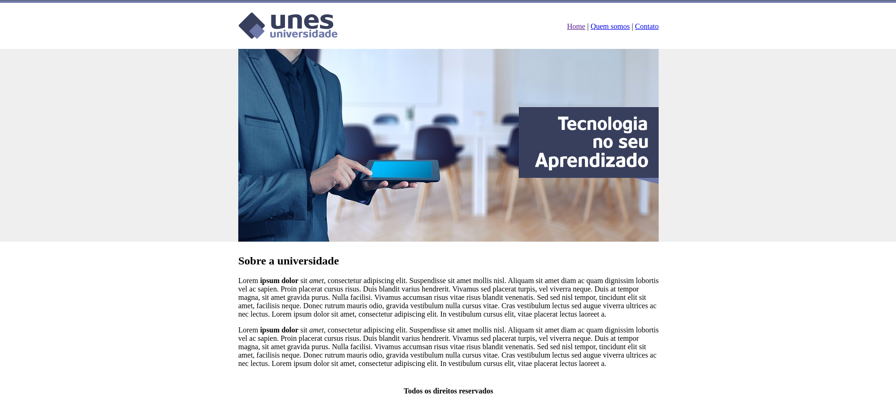
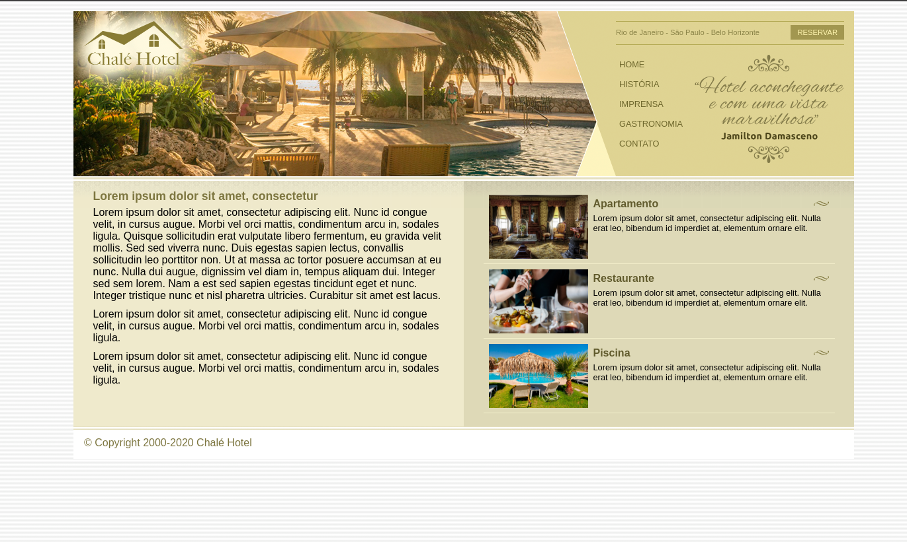
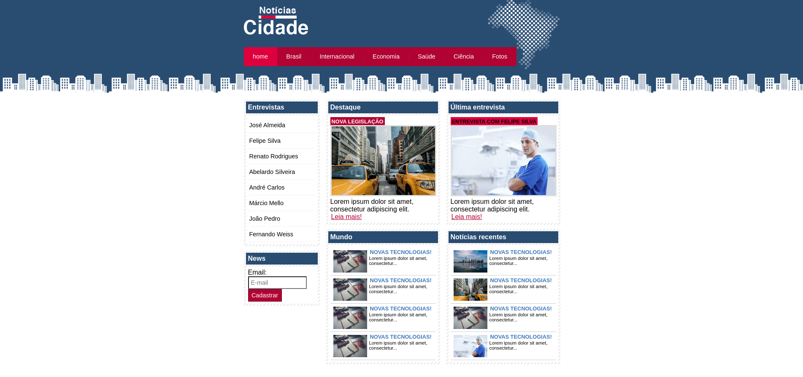
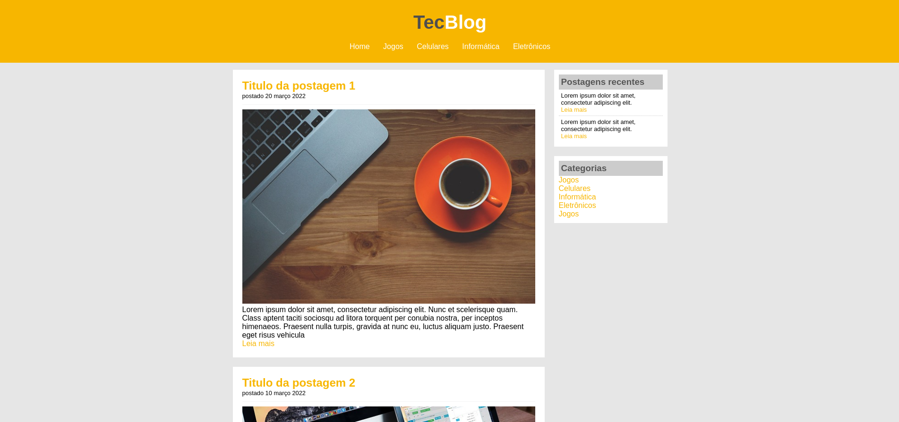
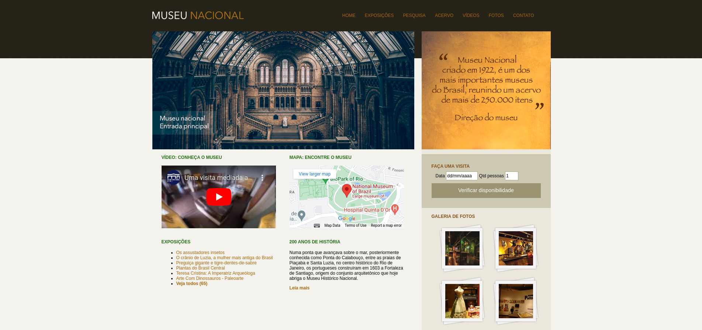
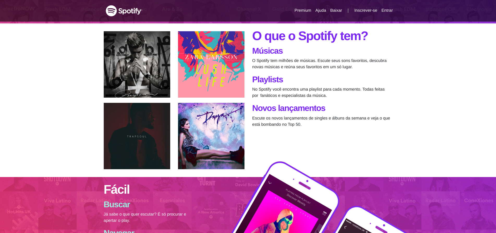

<h1 align="center">Curso de Desenvolvimento Web Completo</h1>

🌱 Este repositório contém o conteúdo que venho estudando durante o curso de Desenvolvimento Web Completo, onde aborda desde o front-end até o back-end e banco de dados, utilizando diversas tecnologias. Até o momento, explorei a criação de aplicações web, como, HTML, CSS, JavaScript, ES7, Bootstrap, Saas, publicação de aplicações Web na Internet.

<h3 align="left">Connect with me:</h3>

<h3 align="left">Languages and Tools:</h3>

 
  
 
  
  
 
  
 
  

<h2>Objetivos do Curso</h2>

Aprender a criar aplicações web utilizando tecnologias como HTML5, CSS3, Bootstrap 4, JavaScript (ES6 e ES7), PHP 7, MySQL, jQuery, MVC, API, Ionic e Wordpress.
 Integrar as tecnologias mencionadas acima por meio de projetos reais, desenvolvendo habilidades práticas e construindo aplicações completas.

<h2> Tópicos Abordados </h2>

Durante o curso, você irá explorar os seguintes tópicos:

<h3>✅ HTML5 </h3>
Cabeçalhos, listas, imagens, links, tabelas, formulários, hear, nav, footer, article, section aside.
<h3>✅ CSS3 Intermediário</h3>
Seletores, div & span, cores, modelo caixa, elementos flutuantes, posicionamento, formatando links.
Formatação de links
<h3>✅CSS3 Avançado</h3>

Herança, especifidade, barra navegação vertical e horizontal, abas, layouts líquidos, largura fixa, parallax, fontes customizadas, normalize css, cantos arredondados, degradês, sombras, animações, transições, flexbox.

<h3>✅Bootstrap</h3>

Responsivo, textos, alinhamentos, cores, media query, botões, barra navegação, listas, inputs, alertas, tabelas, cards, grids, flexbox.

<h3>✅JavaScript</h3>
Variáveis, array, condicionais, operadores de comparação, operadores lógicos, funções, eventos, DOM, loops, BOM.
<h3>✅ES6/ES7</h3>
Var e let, orientação a objetos, literais, prototype, web storage, funções de array.

<h3>PHP7</h3>

Variáveis, arrays, condicionais, operadores de comparação e lógicos, funções, orientação a objetos, abstração, herança, polimorfismo, interfaces.

<h3>Banco de Dados MySQL</h3>
Insert, update, select, delete, filtros, operadores de comparação e lógicos, relacionamentos, inner join, left join, right join.
<h3>Ajax</h3>

Requisições síncronas, requisições assíncronas, XMLHttpRequest, estados da requisição, status, notação XML, notação JSON.

<h3>PHP com PDO e MySQL</h3>

Conexão com banco, executando instruções SQL, fetch, fetch all, foreach, SQL injection.

<h3>Publicação de aplicações Web na Internet</h3>
DNS, hospedagem, cPainel, FTP, configuração do PHP e MySQL.
<h3>jQuery</h3>

Selecionando e manipulando elementos HTML, navegando entre elementos, manipulando CSS, eventos de teclado, mouse e formulário, animações, ajax..

<h3>MVC com PHP</h3>

composer, controlador, rota, modelo, visão, abstração, reutilizando layout, conexão com banco de dados.

<h3>Projeto Twitter clone</h3>
Registro e autenticação de usuários, criando timeline, pesquisando usuários, exibindo tweets, seguindo e deixando de seguir, paginação.
<h3>API com Framework Slim</h3>

Requisições, rotas, dependências, middleware, respostas, banco de dados, criando API.

<h3>Sass</h3>

Alinhamento, variáveis, interpolação, for, while, each, funções, mixin, herança, diretivas de controle.

<h3>Ionic</h3>
Componentes, botões, entrada de dados, data biding, angular, grids, navegação e modelo.
<h3>WordPress</h3>
Instalação, temas, personalização, plugins, usuários, comentários, criador de páginas com elementor.

### Projetos
- Projeto 01 - UNES
 

- Projeto 02 - Anna Bella
 

- Projeto 03 - Chalé Hotel
 

- Projeto 04 - Noticias da Cidade
 

- Projeto 05 - TecBlog
 

- Projeto 06 - Museu Nacional
 

- Projeto 06 - Spotify
 
